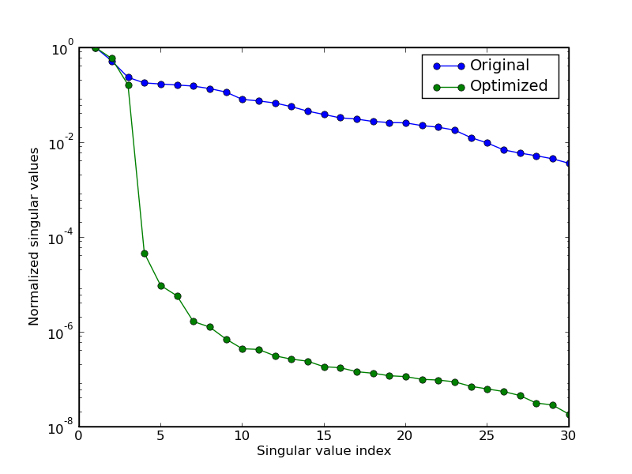
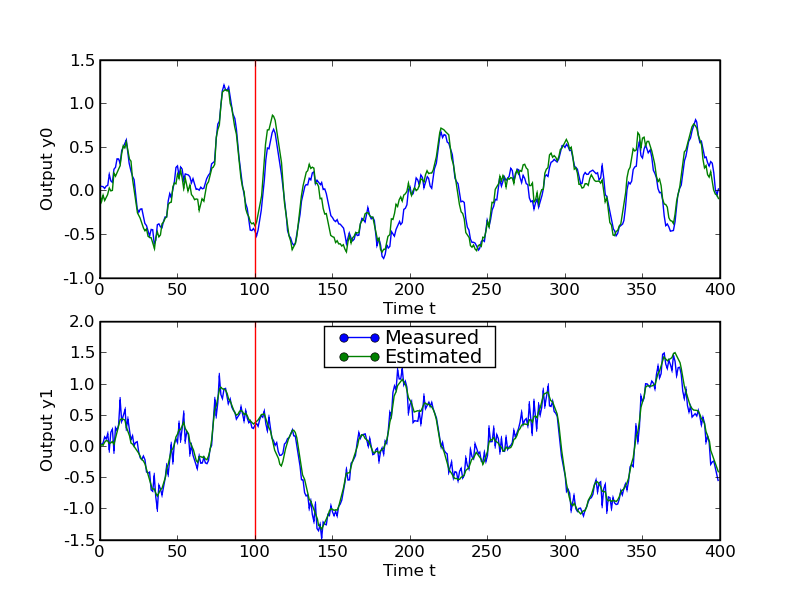
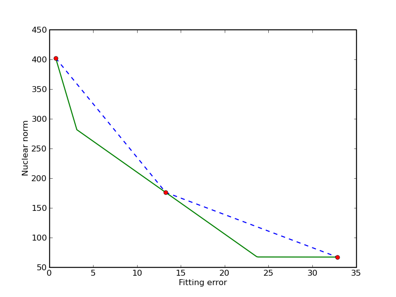
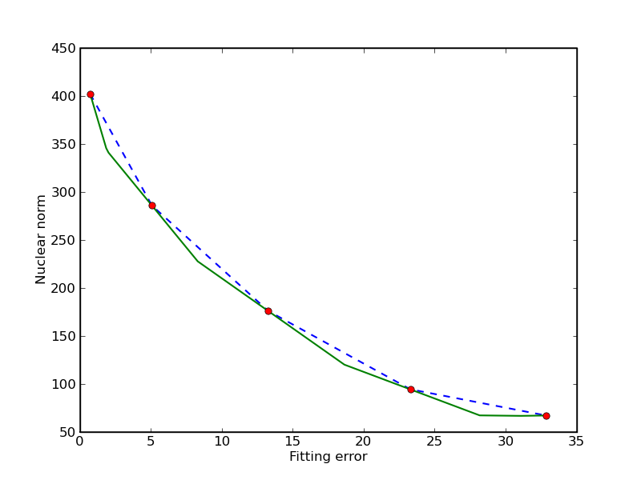
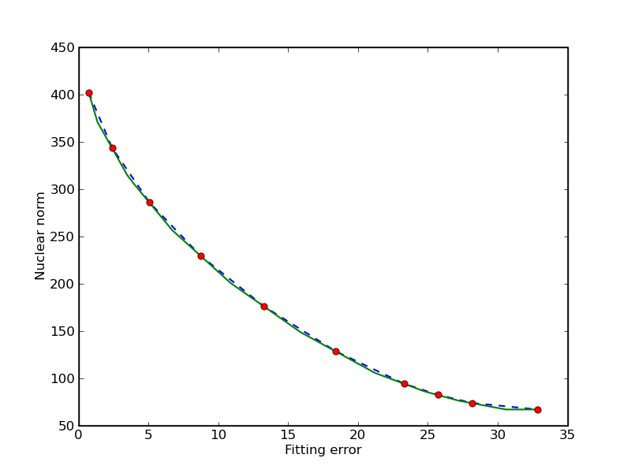

.. role:: raw-html(raw)
    :format: html

**************************
Nuclear norm approximation
**************************

This software accompanies the paper 
`Interior-point method for nuclear norm approximation with application 
to system identification 
<http://www.ee.ucla.edu/~vandenbe/publications/nucnrm.pdf>`_ (pdf) 
by Zhang Liu and Lieven Vandenberghe.  
The code can be downloaded as a :download:`zip file <nucnrm.zip>`
and requires CVXOPT version 1.1.1 or higher and Python 2.7.

.. raw:: html

   <h2> Purpose </h2>

A function is provided to solve a linear matrix approximation problem 
in the nuclear norm, possibly with quadratic regularization.
The general optimization problem  is

.. math::

    \begin{array}[t]{ll}
    \mbox{minimize} & \|A(x) - B\|_* + (1/2) x^T C x + d^T x \\
    \mbox{subject to} &  Gx \preceq  h
    \end{array} 

where 

.. math::

    A(x) = x_1 A_1 + x_2 A_2 + \cdots + x_n A_n 

is a linear matrix valued function.  The norm in the first term of the 
objective is the *nuclear norm* (sum of singular values).  The second term 
is a general convex quadratic function.  The constraints are componentwise 
linear inequalities.

This problem is of interest as a convex heuristic for a regularized 
rank minimization problem

.. math::

    \newcommand{\Rank}{\mathop{\bf rank}}
    \begin{array}[t]{ll}
    \mbox{minimize} & \Rank(A(x) - B) + (1/2) x^T C x + d^T x \\
    \mbox{subject to} &  Gx \preceq  h
    \end{array} 

which in general is very difficult.

.. raw:: html

   <h2>  System identification example </h2>

The package contains several examples, including a system identification
problem.  In this example, we fit a linear state space model to measured 
inputs and outputs of a dynamical system.  The model is constructed from 
the solution of a regularized nuclear norm minimization problem

.. math::

    \begin{array}{ll}
    \mbox{minimize} & \displaystyle \| Y U^\perp \|_* + 
         \gamma \sum_{t=1}^N \|y(t) - y_\mathrm{meas}(t)\|_2^2.
    \end{array}

The optimization variables :math:`y(t)` in the problem are the model 
outputs.  The vectors :math:`y_\mathrm{meas}(t)` are given, measured, 
outputs.  The matrix :math:`Y` is a block Hankel matrix constructed from 
the variables :math:`y(t)`.   The matrix :math:`U^\perp` is a matrix whose 
columns span the nullspace of a block Hankel matrix :math:`U` constructed 
from measured inputs :math:`u_\mathrm{meas}(t)`.
At the optimum the matrix :math:`Y U^\perp` is low rank, and its rank is
equal to the order of a linear model that maps the measured inputs to
the corrected outputs.

The figures illustrate the results for the compact disc arm data
of the `Daisy <http://homes.esat.kuleuven.be/~smc/daisy>`_
collection.
The first figure shows the singular values of the matrix 
:math:`YU^\perp` constructed from the optimized outputs, and the matrix
:math:`Y_\mathrm{meas}U^\perp` constructed from the measured outputs. 
The plot suggests a model of order three.
The second figure compares the actual outputs with the outputs of the
identified model.

.. raw:: html

    <h2> Trade-off curve envelope </h2>

In this example we compute bounds on the trade-off curve of the
bicriterion problem 

.. math::

   \newcommand{\reals}{\mbox{\bf R}}
   \begin{array}{ll}
   \mbox{minimize (w.r.t. $\reals_2^+$)} & 
     (\|A(x) - B\|_*, \;\;  \| x-x_0\|_2^2)
   \end{array}

for a randomly generated problem.  Points on the trade-off curve can be
computed by solving the scalarized problem

.. math::

   \begin{array}{ll}
   \mbox{minimize} & \|A(x) - B\|_* + \gamma \| x-x_0\|_2^2
   \end{array}

for different weights.  Since the trade-off curve is convex, we can also
derive upper and lower bounds from the solutions of the scalarized problems.
The figures show the bounds after the computation of 3, 5, and 10
scalarized problems.   The trade-off curve is in the union of 
the triangular areas enclosed by the solid and dashed lines.  

