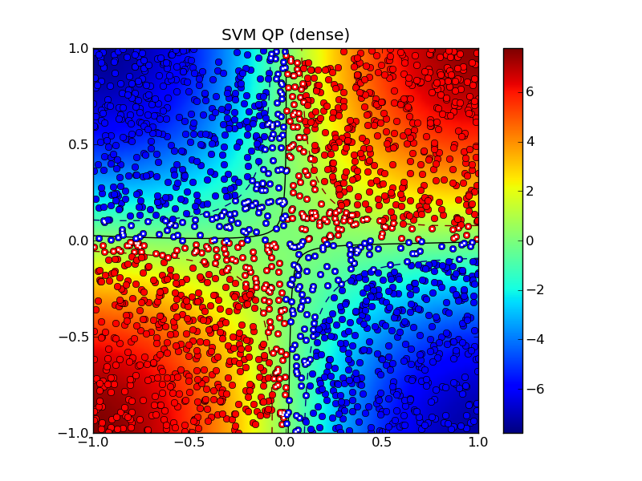
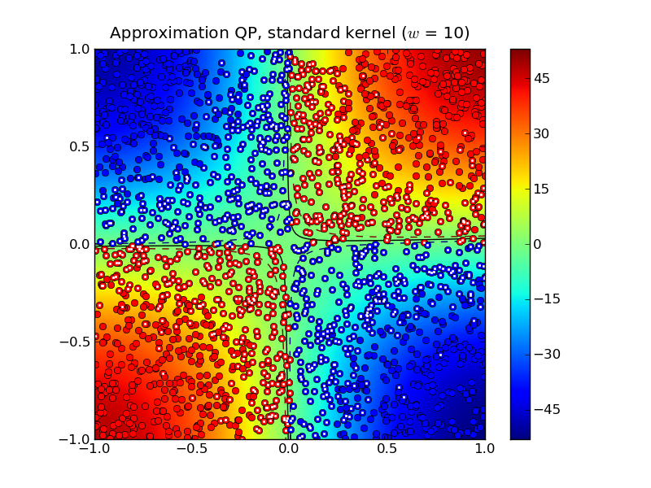
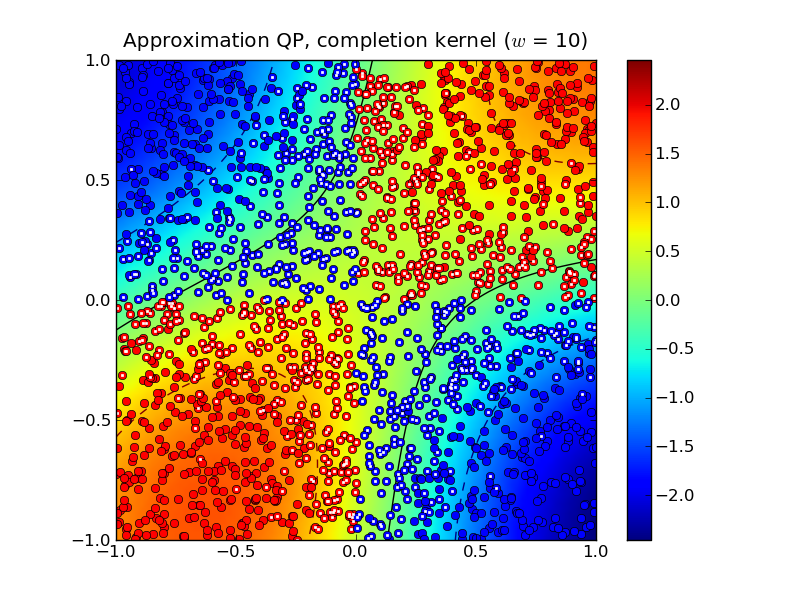
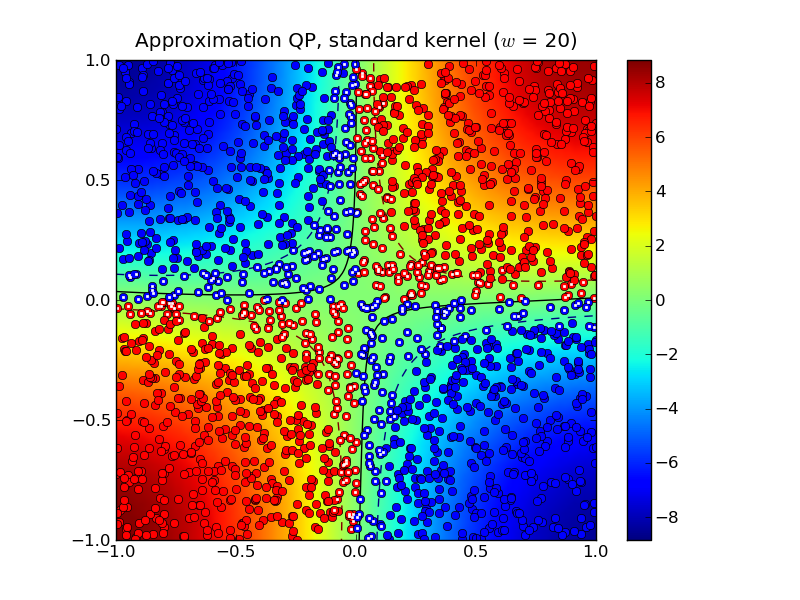
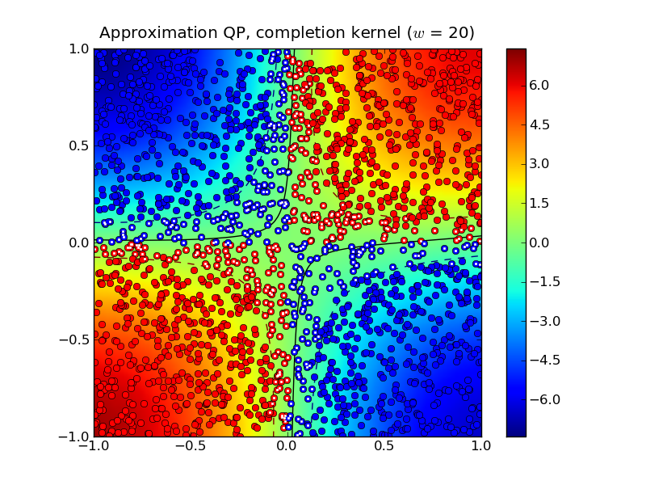
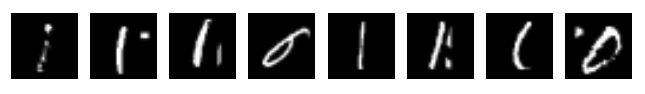

.. role:: raw-html(raw)
   :format: html

***********************
Support Vector Machines
***********************

This software accompanies the paper `Support vector machine training
using matrix completion techniques
<http://www.ee.ucla.edu/~vandenbe/publications/svmcmpl.pdf>`_ by
Martin Andersen and Lieven Vandenberghe. The code can be downloaded as
a :download:`zip file <svmcmpl.zip>` and
requires the Python extensions `CVXOPT
<http://cvxopt.org>`_ and `CHOMPACK 2.3.1
<http://cvxopt.github.io/chompack>`_ or later.

.. raw:: html

   <h4> Feedback and bug reports </h4>

We welcome feedback, and bug reports are much appreciated. Please
email bug reports to :raw-html:`<kbd>martin.skovgaard.andersen@gmail.com</kbd>`.

========
Overview
========

This software provides two routines for soft-margin support vector
machine training. Both routines use the CVXOPT QP solver which
implements an interior-point method. 

The routine :func:`softmargin` solves the standard SVM QP. It computes
and stores the entire kernel matrix, and hence it is only suited for
small problems.

The routine :func:`softmargin_appr` solves an *approximate problem* in
which the (generally dense) kernel matrix is replaced by a positive
definite approximation (the maximum determinant positive definite
completion of a partially specified kernel matrix) whose inverse is
sparse. This can be exploited in interior-point methods, and the
technique is implemented as a custom KKT solver for the CVXOPT QP
solver. As a consequence, :func:`softmargin_appr` can handle much
larger problems than :func:`softmargin`.

=============
Documentation
=============

.. function:: softmargin(X, d, gamma, kernel = 'linear', sigma = 1.0, degree = 1, theta = 1.0)

   Solves the 'soft-margin' SVM problem 

   .. math::

      \begin{array}{ll}	
      \mbox{maximize}   & -(1/2) z^T Q z + d^Tz \\
      \mbox{subject to} & 0 \preceq \mathrm{diag}(d) z \preceq \gamma \mathbf{1} \\
      & \mathbf{1}^T z =0 
      \end{array}
        
   (with variables :math:`z`), and its dual problem

   .. math::

      \begin{array}{ll}
      \mbox{minimize}   & (1/2) y^T Q^{-1} y + \gamma \mathbf{1}^Tv \\
      \mbox{subject to} &  \mathrm{diag}(d) (y + b \mathbf{1}) \succeq \mathbf{1} - v \\
      & v \succeq 0 
      \end{array}

   (with variables :math:`y`, :math:`v`, :math:`b`).  

   The :math:`m \times m` kernel matrix :math:`Q` is given by
   :math:`Q_{ij} = h(x_i, x_j)` where :math:`h` is a kernel function
   and :math:`x_i^T` is the i'th row of the :math:`m \times n` data
   matrix :math:`X`, and :math:`d` is an :math:`m`-vector with labels
   (*i.e.* :math:`d_i \in \{ -1,1\}`).  If :math:`Q` is singular, we
   replace :math:`Q^{-1}` in the dual with its pseudo-inverse and add
   a constraint :math:`y \in \mathrm{Range}(Q)`.

   Valid kernel functions are:

   :const:`'linear'`
	the linear kernel: :math:`h(x_i,x_j) = x_i^Tx_j/\sigma`

   :const:`'poly'`
	the polynomial kernel: :math:`h(x_i,x_j) = (x_i^Tx_j/\sigma)^d` 
	
   :const:`'rbf'`
        the radial basis function: :math:`h(x_i,x_j) = \exp\{ -\|x_i-x_j\|^2/(2\sigma)\}`

   :const:`'tanh'`
	the sigmoid kernel: :math:`h(x_i,x_j) = \tanh(x_i^Tx_j/\sigma - \theta)`

   The kernel parameters :math:`\sigma`, :math:`d`, and :math:`\theta`
   are specified using the input arguments `sigma`, `degree`, and `theta`,
   respectively.
   
   :func:`softmargin` returns a dictionary with the following keys:

   :const:`'classifier'` 
         a Python function object that takes an
         :math:`M \times n` matrix with test vectors as rows and returns a vector with labels

   :const:`'z'`  
         a sparse :math:`m`-vector 

   :const:`'cputime'` 
         a tuple (:math:`T_{\rm tot}`, :math:`T_{\rm qp}`,
	 :math:`T_{\rm ker}`) where :math:`T_{\rm tot}` is the
         total CPU time, :math:`T_{\rm qp}` is the CPU time spent
         solving the QP, and :math:`T_{\rm ker}` is the CPU time spent
         computing the kernel matrix
 
   :const:`'iterations'`
         the number of interior point iterations

   :const:`'misclassified'` 
         a tuple (`L1`, `L2`) where `L1` is a list
         of indices of misclassified training vectors from class 1, and
         `L2` is a list of indices of misclassified training vectors from
         class 2
	 
.. function:: softmargin_appr(X, d, gamma, width, kernel = 'linear', sigma = 1.0, degree = 1, theta = 1.0)

   Solves the 'soft-margin' SVM problem

   .. math::

      \begin{array}{ll}	
      \mbox{maximize}   & -(1/2) z^T \tilde{Q} z + d^Tz \\
      \mbox{subject to} & 0 \preceq \mathrm{diag}(d) z \preceq \gamma \mathbf{1} \\
      & \mathbf{1}^T z =0 
      \end{array}
        
   (with variables :math:`z`), and its dual problem

   .. math::

      \begin{array}{ll}
      \mbox{minimize}   & (1/2) y^T \tilde{Q}^{-1} y + \gamma \mathbf{1}^Tv \\
      \mbox{subject to} &  \mathrm{diag}(d) (y + b \mathbf{1}) \succeq \mathbf{1} - v \\
      & v \succeq 0 
      \end{array}

   (with variables :math:`y`, :math:`v`, :math:`b`).  

   The :math:`m \times m` kernel matrix :math:`\tilde{Q}` is the
   maximum determinant completion of the projection of Q on a band
   with bandwidth :math:`2w+1`. Here :math:`Q_{ij} = h(x_i, x_j)` where
   :math:`h` is one of the kernel functions defined under
   :func:`softmargin` and :math:`x_i^T` is the i'th row of the
   :math:`m \times n` data matrix :math:`X`. The :math:`m`-vector
   :math:`d` is a vector with labels (*i.e.* :math:`d_i \in \{
   -1,1\}`).  The half-bandwidth parameter :math:`w` is set using the
   input argument `width`. 
 
   :func:`softmaring_appr` returns a dictionary that contains the same
   keys as the dictionary returned by :func:`softmargin`. In
   addition to these keys, the dictionary returned by
   :func:`softmargin_appr` contains an second classifier:

   :const:`'completion classifier'` 
        a Python function object that
   	takes an :math:`M \times n` matrix with test vectors as rows
   	and returns a vector with labels

=========
Example 1
=========

As a toy example, consider the following classification problem with
two (nonlinearly) separable classes.  We use as training set :math:`m`
points in :math:`\mathbf{R}^2` generated according to a uniform
distribution over the box :math:`\mathcal{B} = \{ x\,|\,\|x\|_\infty
\leq 1 \}`. We assign labels using the function
:math:`\mathrm{sign}(f(x)) = \mathrm{sign}(x_1 x_2)`, *i.e.*, points
in the first and third quadrants belong to class 1 and points in the
second and fourth quadrants belong to class 2. We remark that in this
simple example, the degree 2 polynomial kernel can separate the two
classes.

The following Python code illustrates how to solve this classification
problem using each of the two routines provided in SVMCMPL.  In this
example we solve a problem instance with 2,000 training
points, and we use :math:`\gamma = 2.0` and the RBF kernel with
:math:`\sigma = 1.0`. ::

    import cvxopt, svmcmpl
    m = 2000
    X = 2.0*cvxopt.uniform(m,2)-1.0
    d = cvxopt.matrix([2*int(v>=0)-1 for v in cvxopt.mul(X[:,0],X[:,1])],(m,1))
    gamma = 2.0; kernel = 'rbf'; sigma = 1.0; width = 20
    sol1 = svmcmpl.softmargin(X, d, gamma, kernel, sigma)
    sol2 = svmcmpl.softmargin_appr(X, d, gamma, width, kernel, sigma)

Solving the standard (dense) SVM problem produced 445 support
vectors, marked with white dots in the plot below:

The solid curve marks the decision boundry whereas the dashed curves
are the -1 and +1 contours of :math:`g(x)` where
:math:`\mathrm{sign}(g(x))` is the decision function.

Solving the approximation problem with half-bandwidth :math:`w = 10`
produced 1,054 support vectors. 

In this example, the standard kernel classifier is clearly better than
the completion kernel classifier at this bandwidth. Increasing the
half-bandwidth to :math:`w = 20` produced 467 support vectors.

Notice that both the standard kernel and completion kernel classifiers
are now nearly identical to classifier obtained by solving the
standard SVM QP. 

Solving the dense SVM QP required 7.0 seconds whereas the approximation
QPs required 0.3 seconds and 0.7 seconds for :math:`w = 10` and :math:`w =
20`, respectively.

=========
Example 2
=========

The following example demonstrates the approximate SVM method on the
`MNIST database <http://yann.lecun.com/exdb/mnist/>`_ of handwritten
digits. In the example we use the Python module :download:`mnist.py
<mnist.py>` to read the database files. The following code trains
a binary classifier using as training set 4,000 examples of the digit
'0' as class 1 and 4,000 examples of the digit '1' as class 2. ::

    import mnist, svmcmpl, cvxopt, random    

    digits1 = [ 0 ]
    digits2 = [ 1 ]

    m1 = 4000; m2 = 4000

    # read training data
    images, labels = mnist.read(digits1 + digits2, dataset = "training", path = "data/mnist")
    images = images / 256.
    
    C1 = [ k for k in xrange(len(labels)) if labels[k] in digits1 ] 
    C2 = [ k for k in xrange(len(labels)) if labels[k] in digits2 ] 
    
    random.seed()
    random.shuffle(C1)
    random.shuffle(C2)	
    
    train = C1[:m1] + C2[:m2]
    random.shuffle(train)
    X = images[train,:]
    d = cvxopt.matrix([ 2*(k in digits1) - 1 for k in labels[train] ])

    gamma = 4.0
    sol = svmcmpl.softmargin_appr(X, d, gamma, width = 50, kernel = 'rbf', sigma = 2**5)

In this example, both the standard kernel classifier and the completion kernel classifier misclassified 8 out of 2,115 test examples (digits '0' and '1' from the MNIST test set):

