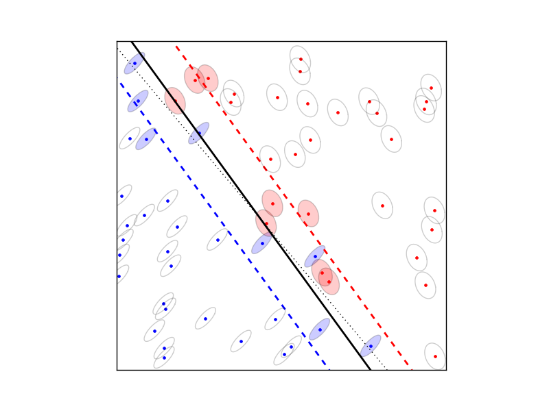

.. role: raw-html(raw)
   :format: html

Robust SVM
==========

The robust SVM training problem can be expressed as a cone QP with second-order cone constraints:

.. math::

   \begin{array}{ll}	
   \mbox{minimize}   & (1/2) w^Tw + \gamma \mathbf{1}^Tv \\
   \mbox{subject to} & \mathbf{diag}(d)(Xw + b \mathbf{1} )
                       \succeq 1 - v + Eu \\
                     & v \succeq 0 \\
		     & \| S_j w\|_2 \leq u_j, \quad j =1,\ldots,t.
   \end{array}

The variables are :math:`w \in \mathbf{R}^n`, :math:`b \in
\mathbf{R}`, :math:`v \in \mathbf{R}^N`, and :math:`u \in
\mathbf{R}^t`. The matrix :math:`X \in \mathbf{R}^{N\times n}` has as its
rows the training examples :math:`x_i^T` and the vector :math:`d \in
\{-1, 1\}^N` contains the training labels. The matrices :math:`S_j` define the shape and the size of the uncertainty ellipsoids, and the matrix :math:`E` is a selector matrix with zeros and one '1' per
row.  :math:`E_{ij} = 1` means that the i'th training vector is
associated with the j'th uncertainty ellipsoid. For :math:`t = 0`, the
term :math:`Eu` and the norm constraints are absent, and the problem
reduces to the standard linear SVM

.. math::

   \begin{array}{ll}	
   \mbox{minimize}   & (1/2) w^Tw + \gamma \mathbf{1}^Tv \\
   \mbox{subject to} & \mathbf{diag}(d)(Xw + b \mathbf{1} )
                       \succeq 1 - v  \\
                     & v \succeq 0.
   \end{array}

.. raw:: html

   <h3> Documentation </h3>

A custom solver for the robust SVM problem is available as a Python
module :download:`robsvm.py <robsvm.py>`. The  module implements the following function:

   .. function:: robsvm(X, labels, gamma, P, e)

      Solves the 'soft-margin' robust SVM problem.

      The first three input arguments are the data matrix :math:`X`
      (with the :math:`N` training examples :math:`x_i^T` as rows),
      the label vector :math:`d`, and the positive parameter
      :math:`\gamma`. The fourth input argument `P` must be a Python
      list of :math:`t` matrices :math:`S_1,\ldots,S_t`. The last
      argument `e` is an :math:`N`-vector where the i'th element
      :math:`e_i \in \{0,..,t-1\}` is the index of the uncertainty
      ellipsoid associated with the i'th training vector.

      The function returns :math:`w`, :math:`b`, :math:`u`, :math:`v`,
      and the number of iterations (an integer).

.. raw:: html

   <h3> Example </h3>

::

  from robsvm import robsvm
  from cvxopt import matrix, normal, uniform

  # parameters
  m, n = 60, 2
  gamma = 10.0  

  # generate random problem data
  X = 2.0*uniform(m,n)-1.0
  d = matrix(1,(m,1))

  # generate noisy labels
  w0 = matrix([2.0,1.0])+normal(2,1); b0 = 0.4
  z = 0.2*normal(m,1)
  for i in range(m):
      if (X[i,:]*w0)[0] + b0 < z[i]: d[i] = -1

  # generate uncertainty ellipsoids
  k = 2
  P = [0.1*normal(4*n,n) for i in range(k)]
  P = [ p.T*p for p in P]
  e = matrix(0,(m,1))
  for i in xrange(m): 
      if d[i] == -1: e[i] = 1
    
  # solve SVM training problem
  w, b, u, v, iterations = robsvm(X, d, gamma, P, e)

  
